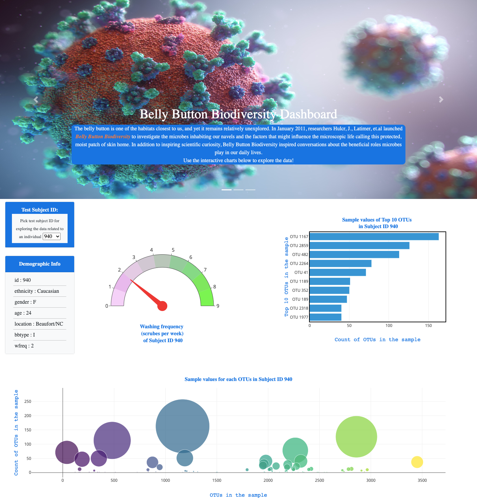

# Belly Button Biodiversity

The belly button is one of the habitats closest to us, and yet it remains relatively unexplored. In January 2011, researchers Huclr, J., Latimer, et al launched Belly Button Biodiversity to investigate the microbes inhabiting our navels and the factors that might influence the microscopic life calling this protected, moist patch of skin home. In addition to inspiring scientific curiosity, Belly Button Biodiversity inspired conversations about the beneficial roles microbes play in our daily lives.

This project is to build an interactive dashboard to explore the [Belly Button Biodiversity dataset](http://robdunnlab.com/projects/belly-button-biodiversity/), which catalogs the microbes that colonize human navels. The dataset reveals that a small handful of microbial species (also called operational taxonomic units, or OTUs, in the study) were present in more than 70% of people, while the rest were relatively rare.

**Javascript libraries [d3](https://d3js.org/) and [Plotly](https://plotly.com/javascript/) are used in this project.**

## Website is deployed [here!](https://bnarath.github.io/BellyButtonBiodiversity/)

## Steps

1. D3 library is used to read [data.](data/samples.json)

2. Create a horizontal bar chart with a dropdown menu to display the top 10 OTUs found in that individual.

* Use `sample_values` as the values for the bar chart.

* Use `otu_ids` as the labels for the bar chart.

* Use `otu_labels` as the hovertext for the chart.

3. Create a bubble chart that displays each sample.

* Use `otu_ids` for the x values.

* Use `sample_values` for the y values.

* Use `sample_values` for the marker size.

* Use `otu_ids` for the marker colors.

* Use `otu_labels` for the text values.

4. Display the sample metadata, i.e., an individual's demographic information.

5. Display each key-value pair from the metadata JSON object somewhere on the page.

6. Draw a [Gauge Chart](https://plot.ly/javascript/gauge-charts/) to plot the weekly washing frequency of the individual.

* Modify the example gauge code to account for values ranging from 0 through 9.

* Update the chart whenever a new sample is selected.

7. Update all of the plots any time that a new sample is selected.

## References

* [Plotly.js documentation](https://plot.ly/javascript/)
* [d3 documentation](https://d3js.org/)

### About the Data

Hulcr, J. et al.(2012) _A Jungle in There: Bacteria in Belly Buttons are Highly Diverse, but Predictable_. Retrieved from: [http://robdunnlab.com/projects/belly-button-biodiversity/results-and-data/](http://robdunnlab.com/projects/belly-button-biodiversity/results-and-data/)

- - -

